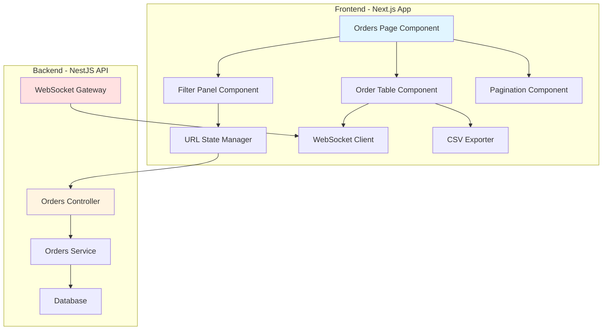

# Design Document: Hospital Order History Dashboard

## Overview

The Hospital Order History Dashboard is a full-stack feature that provides hospitals with a comprehensive interface to view, filter, sort, export, and monitor their blood order history in real-time. The system consists of three main layers:

1. **Frontend Dashboard**: A Next.js page with React components for displaying orders in a filterable, sortable table with real-time updates
2. **Backend API Extensions**: Enhanced REST endpoints in the existing NestJS orders module to support filtering, sorting, and pagination
3. **Real-Time Communication**: WebSocket integration for live order status updates

The design emphasizes client-side state management with URL persistence, efficient data fetching with server-side filtering, and seamless real-time updates without disrupting user interactions.

### Key Design Decisions

- **URL-based state management**: All filter and sort states are persisted in URL query parameters, enabling bookmarking and sharing of specific views
- **Server-side filtering**: Filtering logic is implemented on the backend to reduce data transfer and improve performance for large datasets
- **Client-side CSV export**: Export functionality uses client-side data to avoid additional API calls
- **Optimistic UI updates**: WebSocket updates modify only affected rows to prevent full table re-renders
- **Active orders prioritization**: Orders with active statuses are displayed at the top of the table regardless of sort order

## Architecture

### System Architecture



### Data Flow

1. **Initial Load**:
   - Page component reads URL query parameters
   - Constructs API request with filters, sort, and pagination
   - Fetches orders from backend API
   - Establishes WebSocket connection for real-time updates

2. **Filter Application**:
   - User interacts with filter controls
   - URL State Manager updates browser URL
   - API request triggered with new filter parameters
   - Table updates with filtered results

3. **Real-Time Updates**:
   - Backend emits order status change via WebSocket
   - Frontend WebSocket client receives update
   - Specific order row updated in table state
   - UI reflects change without full re-render

4. **CSV Export**:
   - User clicks export button
   - CSV Exporter processes current table data
   - Browser downloads generated CSV file

### Technology Stack

**Frontend**:
- Next.js 16 (App Router)
- React 19
- TypeScript
- Tailwind CSS
- lucide-react (icons)
- date-fns (date formatting)
- Socket.IO Client (WebSocket)

**Backend**:
- NestJS
- Socket.IO (WebSocket Gateway)
- Existing Orders Module

## Components and Interfaces

### Frontend Components

#### 1. OrdersPage Component (`app/dashboard/orders/page.tsx`)

Main page component that orchestrates all child components and manages global state.

**Responsibilities**:
- Initialize filters from URL parameters
- Fetch orders data from API
- Manage WebSocket connection lifecycle
- Coordinate state between child components
- Handle error states and loading states

**State**:
```typescript
interface OrdersPageState {
  orders: Order[];
  loading: boolean;
  error: string | null;
  filters: OrderFilters;
  sort: SortConfig;
  pagination: PaginationConfig;
  wsConnected: boolean;
}
```

**Props**: None (page component)

#### 2. FilterPanel Component

Displays all filter controls and manages filter state.

**Responsibilities**:
- Render date range picker
- Render blood type multi-select
- Render status multi-select
- Render blood bank search input
- Emit filter changes to parent
- Display active filter count
- Provide clear all filters button

**Props**:
```typescript
interface FilterPanelProps {
  filters: OrderFilters;
  onFiltersChange: (filters: OrderFilters) => void;
  onClearFilters: () => void;
  onExport: () => void;
}
```

**State**:
```typescript
interface FilterPanelState {
  dateRangeOpen: boolean;
  bloodTypeOpen: boolean;
  statusOpen: boolean;
}
```

#### 3. OrderTable Component

Displays orders in a sortable table with status badges.

**Responsibilities**:
- Render table headers with sort indicators
- Render order rows with formatted data
- Handle column header clicks for sorting
- Display status badges with appropriate styling
- Show empty states
- Highlight active orders

**Props**:
```typescript
interface OrderTableProps {
  orders: Order[];
  sort: SortConfig;
  onSortChange: (column: string) => void;
  loading: boolean;
  emptyMessage: string;
}
```

#### 4. PaginationController Component

Manages pagination controls and page size selection.

**Responsibilities**:
- Display current page and total pages
- Render page navigation buttons
- Provide page size selector
- Display total count and current range
- Emit pagination changes to parent

**Props**:
```typescript
interface PaginationControllerProps {
  currentPage: number;
  pageSize: number;
  totalCount: number;
  onPageChange: (page: number) => void;
  onPageSizeChange: (size: number) => void;
}
```

#### 5. StatusBadge Component

Displays order status with color coding and icons.

**Responsibilities**:
- Render status text with appropriate styling
- Display status-specific icon
- Apply color scheme based on status

**Props**:
```typescript
interface StatusBadgeProps {
  status: OrderStatus;
  size?: 'sm' | 'md' | 'lg';
}
```

**Status Color Mapping**:
- `pending`: Yellow/Amber (#FFA500)
- `confirmed`: Blue (#5C9CE0)
- `in_transit`: Purple (#C68AF2)
- `delivered`: Green (#00BFA5)
- `cancelled`: Red (#D32F2F)

### Frontend Utilities

#### URLStateManager

Manages synchronization between component state and URL query parameters.

**Interface**:
```typescript
class URLStateManager {
  static encodeFilters(filters: OrderFilters): URLSearchParams;
  static decodeFilters(params: URLSearchParams): OrderFilters;
  static updateURL(filters: OrderFilters, sort: SortConfig, page: number): void;
  static readFromURL(): { filters: OrderFilters; sort: SortConfig; page: number };
}
```

**Query Parameter Format**:
- `startDate`: ISO date string (YYYY-MM-DD)
- `endDate`: ISO date string (YYYY-MM-DD)
- `bloodTypes`: Comma-separated values (e.g., "A+,O-,B+")
- `statuses`: Comma-separated values (e.g., "pending,confirmed")
- `bloodBank`: URL-encoded string
- `sortBy`: Column name
- `sortOrder`: "asc" or "desc"
- `page`: Number
- `pageSize`: Number (25, 50, or 100)

#### WebSocketClient

Manages WebSocket connection and handles real-time order updates.

**Interface**:
```typescript
class WebSocketClient {
  constructor(hospitalId: string);
  connect(): Promise<void>;
  disconnect(): void;
  onOrderUpdate(callback: (order: Order) => void): void;
  onConnectionChange(callback: (connected: boolean) => void): void;
}
```

**Events**:
- `order:updated` - Emitted when order status changes
- `connect` - Connection established
- `disconnect` - Connection lost

#### CSVExporter

Generates CSV files from order data.

**Interface**:
```typescript
class CSVExporter {
  static export(orders: Order[], filename: string): void;
  static formatOrdersToCSV(orders: Order[]): string;
  static downloadCSV(content: string, filename: string): void;
}
```

**CSV Format**:
```
Order ID,Blood Type,Quantity,Blood Bank,Status,Rider,Placed At,Delivered At
ORD-001,A+,5,Central Blood Bank,delivered,John Doe,2024-01-15T10:30:00Z,2024-01-15T14:20:00Z
```

### Backend Components

#### Orders Controller Extensions

Enhanced endpoints to support dashboard requirements.

**New/Modified Endpoints**:

```typescript
@Get()
findAll(
  @Query('hospitalId') hospitalId: string,
  @Query('startDate') startDate?: string,
  @Query('endDate') endDate?: string,
  @Query('bloodTypes') bloodTypes?: string,
  @Query('statuses') statuses?: string,
  @Query('bloodBank') bloodBank?: string,
  @Query('sortBy') sortBy?: string,
  @Query('sortOrder') sortOrder?: 'asc' | 'desc',
  @Query('page') page?: number,
  @Query('pageSize') pageSize?: number,
): Promise<OrdersResponse>;
```

**Response Format**:
```typescript
interface OrdersResponse {
  data: Order[];
  pagination: {
    currentPage: number;
    pageSize: number;
    totalCount: number;
    totalPages: number;
  };
}
```

#### Orders Service Extensions

Enhanced service methods to support filtering, sorting, and pagination.

**New Methods**:
```typescript
async findAllWithFilters(params: OrderQueryParams): Promise<OrdersResponse> {
  // Apply filters
  // Apply sorting
  // Apply pagination
  // Return paginated results with metadata
}
```

#### WebSocket Gateway

New gateway for real-time order status updates.

**Implementation**:
```typescript
@WebSocketGateway({
  cors: { origin: '*' },
  namespace: '/orders'
})
export class OrdersGateway {
  @WebSocketServer()
  server: Server;

  emitOrderUpdate(hospitalId: string, order: Order): void {
    this.server.to(`hospital:${hospitalId}`).emit('order:updated', order);
  }

  @SubscribeMessage('join:hospital')
  handleJoinHospital(client: Socket, hospitalId: string): void {
    client.join(`hospital:${hospitalId}`);
  }
}
```

## Data Models

### Order Model

```typescript
interface Order {
  id: string;                    // Unique order identifier (e.g., "ORD-001")
  bloodType: BloodType;          // Blood type requested
  quantity: number;              // Number of units
  bloodBank: BloodBankInfo;      // Blood bank details
  hospital: HospitalInfo;        // Hospital details
  status: OrderStatus;           // Current order status
  rider: RiderInfo | null;       // Assigned rider (null if not assigned)
  placedAt: Date;                // Order creation timestamp
  deliveredAt: Date | null;      // Delivery completion timestamp (null if not delivered)
  confirmedAt: Date | null;      // Order confirmation timestamp
  cancelledAt: Date | null;      // Cancellation timestamp (null if not cancelled)
  createdAt: Date;               // Record creation timestamp
  updatedAt: Date;               // Record last update timestamp
}
```

### Supporting Types

```typescript
type BloodType = 'A+' | 'A-' | 'B+' | 'B-' | 'AB+' | 'AB-' | 'O+' | 'O-';

type OrderStatus = 'pending' | 'confirmed' | 'in_transit' | 'delivered' | 'cancelled';

interface BloodBankInfo {
  id: string;
  name: string;
  location: string;
}

interface HospitalInfo {
  id: string;
  name: string;
  location: string;
}

interface RiderInfo {
  id: string;
  name: string;
  phone: string;
}

interface OrderFilters {
  startDate: Date | null;
  endDate: Date | null;
  bloodTypes: BloodType[];
  statuses: OrderStatus[];
  bloodBank: string;
}

interface SortConfig {
  column: string;
  order: 'asc' | 'desc';
}

interface PaginationConfig {
  page: number;
  pageSize: 25 | 50 | 100;
}

interface OrderQueryParams extends OrderFilters, SortConfig, PaginationConfig {
  hospitalId: string;
}
```

### Database Schema Considerations

The existing orders table should support the following queries efficiently:

**Required Indexes**:
- `hospital_id` - For filtering by hospital
- `placed_at` - For date range filtering and sorting
- `status` - For status filtering
- `blood_type` - For blood type filtering
- Composite index on `(hospital_id, placed_at)` - For common query pattern
- Composite index on `(hospital_id, status)` - For active orders queries

**Query Patterns**:
```sql
-- Main dashboard query
SELECT * FROM orders
WHERE hospital_id = ?
  AND placed_at BETWEEN ? AND ?
  AND blood_type IN (?)
  AND status IN (?)
  AND blood_bank_name LIKE ?
ORDER BY 
  CASE WHEN status IN ('pending', 'confirmed', 'in_transit') THEN 0 ELSE 1 END,
  placed_at DESC
LIMIT ? OFFSET ?;

-- Count query for pagination
SELECT COUNT(*) FROM orders
WHERE hospital_id = ?
  AND placed_at BETWEEN ? AND ?
  AND blood_type IN (?)
  AND status IN (?)
  AND blood_bank_name LIKE ?;
```

## API Specifications

### REST Endpoints

#### GET /orders

Retrieve paginated, filtered, and sorted orders for a hospital.

**Query Parameters**:
| Parameter | Type | Required | Description |
|-----------|------|----------|-------------|
| hospitalId | string | Yes | Hospital identifier |
| startDate | string (ISO 8601) | No | Filter start date |
| endDate | string (ISO 8601) | No | Filter end date |
| bloodTypes | string (comma-separated) | No | Filter by blood types |
| statuses | string (comma-separated) | No | Filter by statuses |
| bloodBank | string | No | Filter by blood bank name (partial match) |
| sortBy | string | No | Column to sort by (default: "placedAt") |
| sortOrder | string | No | Sort order: "asc" or "desc" (default: "desc") |
| page | number | No | Page number (default: 1) |
| pageSize | number | No | Items per page: 25, 50, or 100 (default: 25) |

**Request Example**:
```
GET /orders?hospitalId=HOSP-001&startDate=2024-01-01&endDate=2024-01-31&bloodTypes=A+,O-&statuses=pending,confirmed&page=1&pageSize=25
```

**Response**:
```json
{
  "data": [
    {
      "id": "ORD-001",
      "bloodType": "A+",
      "quantity": 5,
      "bloodBank": {
        "id": "BB-001",
        "name": "Central Blood Bank",
        "location": "Lagos"
      },
      "hospital": {
        "id": "HOSP-001",
        "name": "General Hospital",
        "location": "Ikeja"
      },
      "status": "in_transit",
      "rider": {
        "id": "RIDER-001",
        "name": "John Doe",
        "phone": "+234-XXX-XXXX"
      },
      "placedAt": "2024-01-15T10:30:00Z",
      "deliveredAt": null,
      "confirmedAt": "2024-01-15T10:35:00Z",
      "cancelledAt": null,
      "createdAt": "2024-01-15T10:30:00Z",
      "updatedAt": "2024-01-15T11:00:00Z"
    }
  ],
  "pagination": {
    "currentPage": 1,
    "pageSize": 25,
    "totalCount": 150,
    "totalPages": 6
  }
}
```

**Error Responses**:
- `400 Bad Request` - Invalid query parameters
- `401 Unauthorized` - Missing or invalid authentication
- `403 Forbidden` - User not authorized for this hospital
- `500 Internal Server Error` - Server error

### WebSocket Events

#### Connection

**Namespace**: `/orders`

**Client Connection**:
```typescript
const socket = io('http://localhost:3000/orders', {
  auth: {
    token: 'JWT_TOKEN'
  }
});
```

#### Events

**1. join:hospital (Client → Server)**

Join a hospital-specific room to receive updates for that hospital's orders.

**Payload**:
```typescript
{
  hospitalId: string;
}
```

**Example**:
```typescript
socket.emit('join:hospital', { hospitalId: 'HOSP-001' });
```

**2. order:updated (Server → Client)**

Emitted when an order's status changes.

**Payload**:
```typescript
{
  id: string;
  status: OrderStatus;
  rider: RiderInfo | null;
  updatedAt: Date;
  deliveredAt: Date | null;
}
```

**Example**:
```typescript
socket.on('order:updated', (update) => {
  console.log('Order updated:', update);
  // Update local state
});
```

**3. connect (Socket.IO built-in)**

Emitted when connection is established.

**4. disconnect (Socket.IO built-in)**

Emitted when connection is lost.

**5. error (Socket.IO built-in)**

Emitted when an error occurs.

## State Management

### URL State Synchronization

The application uses URL query parameters as the single source of truth for filter, sort, and pagination state. This approach provides:

- Bookmarkable views
- Shareable links
- Browser back/forward navigation support
- State persistence across page refreshes

**Implementation Pattern**:

```typescript
// On component mount
useEffect(() => {
  const urlState = URLStateManager.readFromURL();
  setFilters(urlState.filters);
  setSort(urlState.sort);
  setPagination({ page: urlState.page, pageSize: urlState.pageSize });
}, []);

// On state change
useEffect(() => {
  URLStateManager.updateURL(filters, sort, pagination.page);
  fetchOrders();
}, [filters, sort, pagination]);
```

### Local State Management

**Component State Structure**:

```typescript
// OrdersPage component state
const [orders, setOrders] = useState<Order[]>([]);
const [loading, setLoading] = useState(true);
const [error, setError] = useState<string | null>(null);
const [filters, setFilters] = useState<OrderFilters>(defaultFilters);
const [sort, setSort] = useState<SortConfig>({ column: 'placedAt', order: 'desc' });
const [pagination, setPagination] = useState<PaginationConfig>({ page: 1, pageSize: 25 });
const [totalCount, setTotalCount] = useState(0);
const [wsConnected, setWsConnected] = useState(false);
```

### WebSocket State Updates

WebSocket updates are applied optimistically to local state without refetching the entire dataset:

```typescript
const handleOrderUpdate = useCallback((updatedOrder: Partial<Order>) => {
  setOrders(prevOrders => 
    prevOrders.map(order => 
      order.id === updatedOrder.id 
        ? { ...order, ...updatedOrder }
        : order
    )
  );
}, []);
```

**Active Order Reordering**:

When an order transitions from active to completed status, it should be moved from the top section to the appropriate position based on the current sort:

```typescript
const handleOrderUpdate = useCallback((updatedOrder: Partial<Order>) => {
  setOrders(prevOrders => {
    const updated = prevOrders.map(order => 
      order.id === updatedOrder.id ? { ...order, ...updatedOrder } : order
    );
    
    // Re-sort if status changed from active to completed
    if (updatedOrder.status && 
        ['delivered', 'cancelled'].includes(updatedOrder.status)) {
      return sortOrders(updated, sort);
    }
    
    return updated;
  });
}, [sort]);
```

## Error Handling

### Error Categories

1. **Network Errors**: Failed API requests due to connectivity issues
2. **Authentication Errors**: Invalid or expired tokens
3. **Authorization Errors**: User not permitted to access hospital data
4. **Validation Errors**: Invalid filter parameters or query values
5. **WebSocket Errors**: Connection failures or disconnections
6. **Data Errors**: Malformed responses from API

### Error Handling Strategy

#### API Errors

```typescript
async function fetchOrders(params: OrderQueryParams): Promise<OrdersResponse> {
  try {
    const response = await fetch('/api/orders?' + new URLSearchParams(params));
    
    if (!response.ok) {
      if (response.status === 401) {
        throw new AuthenticationError('Session expired. Please log in again.');
      }
      if (response.status === 403) {
        throw new AuthorizationError('You do not have access to this hospital.');
      }
      if (response.status === 400) {
        const error = await response.json();
        throw new ValidationError(error.message);
      }
      throw new NetworkError('Failed to fetch orders. Please try again.');
    }
    
    return await response.json();
  } catch (error) {
    if (error instanceof TypeError) {
      throw new NetworkError('Network connection failed. Please check your internet.');
    }
    throw error;
  }
}
```

#### WebSocket Errors

```typescript
class WebSocketClient {
  connect(): Promise<void> {
    return new Promise((resolve, reject) => {
      this.socket = io('/orders', {
        auth: { token: getAuthToken() },
        reconnection: true,
        reconnectionDelay: 1000,
        reconnectionAttempts: 5
      });
      
      this.socket.on('connect', () => {
        this.onConnectionChange?.(true);
        resolve();
      });
      
      this.socket.on('disconnect', () => {
        this.onConnectionChange?.(false);
      });
      
      this.socket.on('connect_error', (error) => {
        console.error('WebSocket connection error:', error);
        this.onConnectionChange?.(false);
        reject(error);
      });
    });
  }
}
```

### User-Facing Error Messages

**Error Display Component**:

```typescript
interface ErrorDisplayProps {
  error: Error;
  onRetry: () => void;
}

function ErrorDisplay({ error, onRetry }: ErrorDisplayProps) {
  const getMessage = () => {
    if (error instanceof AuthenticationError) {
      return 'Your session has expired. Please log in again.';
    }
    if (error instanceof AuthorizationError) {
      return 'You do not have permission to view this data.';
    }
    if (error instanceof NetworkError) {
      return 'Unable to connect to the server. Please check your internet connection.';
    }
    return 'An unexpected error occurred. Please try again.';
  };
  
  return (
    <div className="p-6 bg-red-50 border border-red-200 rounded-lg">
      <p className="text-red-800 mb-4">{getMessage()}</p>
      <button onClick={onRetry} className="px-4 py-2 bg-red-600 text-white rounded">
        Retry
      </button>
    </div>
  );
}
```

### WebSocket Connection Status

Display a non-intrusive warning when WebSocket connection is lost:

```typescript
{!wsConnected && (
  <div className="mb-4 p-3 bg-yellow-50 border border-yellow-200 rounded-lg flex items-center gap-2">
    <AlertCircle className="w-5 h-5 text-yellow-600" />
    <span className="text-sm text-yellow-800">
      Real-time updates are currently unavailable. The page will still function normally.
    </span>
  </div>
)}
```

### Logging Strategy

**Client-Side Logging**:
```typescript
// Log errors to console in development
if (process.env.NODE_ENV === 'development') {
  console.error('Order fetch failed:', error);
}

// Log errors to monitoring service in production
if (process.env.NODE_ENV === 'production') {
  logToMonitoring({
    level: 'error',
    message: 'Order fetch failed',
    error: error.message,
    stack: error.stack,
    context: { hospitalId, filters }
  });
}
```

**Server-Side Logging**:
```typescript
@Get()
async findAll(@Query() params: OrderQueryParams) {
  try {
    return await this.ordersService.findAllWithFilters(params);
  } catch (error) {
    this.logger.error('Failed to fetch orders', {
      error: error.message,
      stack: error.stack,
      params
    });
    throw new InternalServerErrorException('Failed to fetch orders');
  }
}
```


## Correctness Properties

*A property is a characteristic or behavior that should hold true across all valid executions of a system—essentially, a formal statement about what the system should do. Properties serve as the bridge between human-readable specifications and machine-verifiable correctness guarantees.*

### Property 1: Order Table Display Completeness

*For any* order in the system, when rendered in the order table, the output SHALL contain all required columns: Order ID, Blood Type, Quantity, Blood Bank name, Status, Rider name (or empty if unassigned), Placed At timestamp, and Delivered At timestamp (or empty if not delivered).

**Validates: Requirements 1.1**

### Property 2: Hospital-Specific Order Filtering

*For any* hospital ID, when the dashboard loads, all displayed orders SHALL belong to that hospital and no orders from other hospitals SHALL be displayed.

**Validates: Requirements 1.2**

### Property 3: Active Orders Prioritization

*For any* set of orders containing both active orders (status: pending, confirmed, or in_transit) and completed orders (status: delivered or cancelled), the active orders SHALL appear before all completed orders in the table, regardless of other sort criteria.

**Validates: Requirements 1.3**

### Property 4: Pagination Page Size Limit

*For any* selected page size (25, 50, or 100), the number of orders displayed on a single page SHALL NOT exceed that page size, and changing the page size SHALL reset the current page to 1.

**Validates: Requirements 1.5, 8.3**

### Property 5: Comprehensive Filter Application

*For any* combination of active filters (date range, blood types, statuses, blood bank search), all displayed orders SHALL satisfy ALL active filter conditions:
- If date range is set: order.placedAt MUST be within [startDate, endDate]
- If blood types are selected: order.bloodType MUST be in the selected set
- If statuses are selected: order.status MUST be in the selected set
- If blood bank search is set: order.bloodBank.name MUST contain the search text (case-insensitive)

**Validates: Requirements 2.2, 3.2, 4.2, 5.2**

### Property 6: URL State Round-Trip Preservation

*For any* filter state (including date range, blood types, statuses, blood bank search, sort configuration, and pagination), encoding the state to URL query parameters and then decoding it back SHALL produce an equivalent filter state, preserving all values including special characters in blood bank names.

**Validates: Requirements 2.3, 2.4, 3.3, 3.4, 4.3, 4.4, 5.3, 5.4, 6.1, 6.2, 6.3, 6.4**

### Property 7: Column Sort Ordering

*For any* column and sort order (ascending or descending), after sorting the table by that column:
- In ascending order: for each adjacent pair of rows (i, i+1), row[i][column] ≤ row[i+1][column]
- In descending order: for each adjacent pair of rows (i, i+1), row[i][column] ≥ row[i+1][column]

Note: Active orders prioritization (Property 3) takes precedence over column sorting.

**Validates: Requirements 7.2**

### Property 8: Sort Order Toggle Reversal

*For any* set of orders and any column, sorting by that column in ascending order and then sorting by the same column in descending order SHALL produce the reverse order of the rows (excluding the active/completed grouping).

**Validates: Requirements 7.3**

### Property 9: Sort Column Exclusivity

*For any* current sort state, when a new column is selected for sorting, the sort SHALL be applied only to the new column and the previous sort column SHALL no longer affect the order.

**Validates: Requirements 7.4**

### Property 10: Sort Persistence Across State Changes

*For any* sort configuration (column and order), the sort configuration SHALL remain unchanged when filters are modified or pagination page number changes.

**Validates: Requirements 7.5**

### Property 11: Pagination Slice Correctness

*For any* page number N and page size P, the displayed orders SHALL be the slice of the filtered and sorted dataset from index (N-1) × P to (N × P) - 1, and the displayed range text SHALL accurately reflect these indices.

**Validates: Requirements 8.4, 8.5**

### Property 12: CSV Export Completeness

*For any* set of filtered and sorted orders currently displayed, the generated CSV file SHALL contain exactly those orders in the same order, with all columns (Order ID, Blood Type, Quantity, Blood Bank, Status, Rider, Placed At, Delivered At) present with appropriate headers.

**Validates: Requirements 9.2, 9.3**

### Property 13: CSV Date Format Compliance

*For any* date field (Placed At, Delivered At) in the CSV export, if the date is not null, it SHALL be formatted as a valid ISO 8601 string (YYYY-MM-DDTHH:mm:ss.sssZ).

**Validates: Requirements 9.4**

### Property 14: CSV Filename Format

*For any* CSV export operation, the downloaded filename SHALL match the pattern "orders_export_YYYY-MM-DD.csv" where YYYY-MM-DD is the current date in ISO format.

**Validates: Requirements 9.5**

### Property 15: WebSocket Order Update Propagation

*For any* order status update received via WebSocket, if that order is currently displayed in the table, the order's status badge SHALL update to reflect the new status without requiring a page refresh or manual reload.

**Validates: Requirements 10.2**

### Property 16: Status Badge Visual Mapping

*For any* order status, the rendered status badge SHALL display the correct color and icon according to the status mapping:
- pending: Yellow/Amber (#FFA500) with clock icon
- confirmed: Blue (#5C9CE0) with check icon
- in_transit: Purple (#C68AF2) with truck icon
- delivered: Green (#00BFA5) with check-circle icon
- cancelled: Red (#D32F2F) with x-circle icon

**Validates: Requirements 10.3**

### Property 17: Order Repositioning on Status Change

*For any* order with an active status (pending, confirmed, in_transit) that receives a WebSocket update changing its status to a completed status (delivered, cancelled), the order SHALL move from the active orders section to the completed orders section and be positioned according to the current sort criteria within the completed section.

**Validates: Requirements 10.4**

## Testing Strategy

### Dual Testing Approach

This feature requires both unit testing and property-based testing to ensure comprehensive correctness:

**Unit Tests** focus on:
- Specific examples of filter combinations
- Edge cases (empty states, no orders, no matching filters)
- Error handling scenarios (API failures, WebSocket disconnections)
- User interaction flows (clicking buttons, selecting filters)
- Component rendering with specific props

**Property-Based Tests** focus on:
- Universal properties that hold across all inputs
- Filter correctness across random order datasets
- Sort correctness across random column values
- URL encoding/decoding with random filter states
- CSV export with random order sets
- Pagination calculations with random page sizes and counts

Together, these approaches provide comprehensive coverage: unit tests catch concrete bugs in specific scenarios, while property tests verify general correctness across the input space.

### Property-Based Testing Configuration

**Library Selection**: 
- Frontend: `fast-check` (TypeScript property-based testing library)
- Backend: `fast-check` (can be used with NestJS/Jest)

**Test Configuration**:
- Each property test MUST run a minimum of 100 iterations
- Each test MUST include a comment tag referencing the design property
- Tag format: `// Feature: hospital-order-history-dashboard, Property {number}: {property title}`

**Example Property Test Structure**:

```typescript
import fc from 'fast-check';

// Feature: hospital-order-history-dashboard, Property 5: Comprehensive Filter Application
describe('Order Filtering', () => {
  it('should display only orders matching all active filters', () => {
    fc.assert(
      fc.property(
        fc.array(orderArbitrary),
        fc.record({
          startDate: fc.option(fc.date(), { nil: null }),
          endDate: fc.option(fc.date(), { nil: null }),
          bloodTypes: fc.array(fc.constantFrom('A+', 'A-', 'B+', 'B-', 'AB+', 'AB-', 'O+', 'O-')),
          statuses: fc.array(fc.constantFrom('pending', 'confirmed', 'in_transit', 'delivered', 'cancelled')),
          bloodBank: fc.string()
        }),
        (orders, filters) => {
          const filtered = applyFilters(orders, filters);
          
          // All filtered orders must satisfy all filter conditions
          filtered.forEach(order => {
            if (filters.startDate) {
              expect(order.placedAt >= filters.startDate).toBe(true);
            }
            if (filters.endDate) {
              expect(order.placedAt <= filters.endDate).toBe(true);
            }
            if (filters.bloodTypes.length > 0) {
              expect(filters.bloodTypes).toContain(order.bloodType);
            }
            if (filters.statuses.length > 0) {
              expect(filters.statuses).toContain(order.status);
            }
            if (filters.bloodBank) {
              expect(order.bloodBank.name.toLowerCase()).toContain(filters.bloodBank.toLowerCase());
            }
          });
        }
      ),
      { numRuns: 100 }
    );
  });
});
```

### Unit Testing Strategy

**Component Tests**:
- OrdersPage: Test initial load, error states, loading states
- FilterPanel: Test filter UI interactions, clear filters button
- OrderTable: Test rendering with specific data, empty states
- PaginationController: Test page navigation, page size selection
- StatusBadge: Test rendering for each status type

**Integration Tests**:
- Test complete filter → API → display flow
- Test WebSocket connection and update handling
- Test CSV export with specific datasets
- Test URL state synchronization

**Edge Case Tests**:
- Empty order list (no orders for hospital)
- No matching orders (filters return empty)
- Single order
- Exactly page size orders
- Page size + 1 orders
- Very large order counts (10,000+)
- Orders with null rider
- Orders with null deliveredAt
- Special characters in blood bank names
- Date range with same start and end date

**Error Handling Tests**:
- API returns 401 (authentication error)
- API returns 403 (authorization error)
- API returns 400 (validation error)
- API returns 500 (server error)
- Network timeout
- WebSocket connection failure
- WebSocket disconnection during session
- Malformed API response

### Backend Testing Strategy

**Service Tests**:
- Test findAllWithFilters with various filter combinations
- Test query parameter parsing
- Test pagination calculations
- Test sort logic
- Test date range filtering edge cases

**Controller Tests**:
- Test endpoint parameter validation
- Test authentication/authorization
- Test error response formatting

**WebSocket Tests**:
- Test room joining
- Test order update emission
- Test client disconnection handling

### Test Data Generators

**Order Generator** (for property-based tests):
```typescript
const orderArbitrary = fc.record({
  id: fc.string({ minLength: 5, maxLength: 10 }).map(s => `ORD-${s}`),
  bloodType: fc.constantFrom('A+', 'A-', 'B+', 'B-', 'AB+', 'AB-', 'O+', 'O-'),
  quantity: fc.integer({ min: 1, max: 20 }),
  bloodBank: fc.record({
    id: fc.string(),
    name: fc.string({ minLength: 5, maxLength: 50 }),
    location: fc.string()
  }),
  hospital: fc.record({
    id: fc.string(),
    name: fc.string(),
    location: fc.string()
  }),
  status: fc.constantFrom('pending', 'confirmed', 'in_transit', 'delivered', 'cancelled'),
  rider: fc.option(fc.record({
    id: fc.string(),
    name: fc.string(),
    phone: fc.string()
  }), { nil: null }),
  placedAt: fc.date({ min: new Date('2020-01-01'), max: new Date('2025-12-31') }),
  deliveredAt: fc.option(fc.date(), { nil: null }),
  confirmedAt: fc.option(fc.date(), { nil: null }),
  cancelledAt: fc.option(fc.date(), { nil: null }),
  createdAt: fc.date(),
  updatedAt: fc.date()
});
```

### Coverage Goals

- Unit test coverage: Minimum 80% line coverage
- Property test coverage: All 17 correctness properties implemented
- Integration test coverage: All critical user flows
- E2E test coverage: Complete filter → sort → export → WebSocket update flow

### Continuous Testing

- All tests run on every commit (CI/CD pipeline)
- Property tests run with increased iterations (1000+) in nightly builds
- Performance tests for large datasets (10,000+ orders) in weekly builds
- WebSocket stress tests in staging environment
